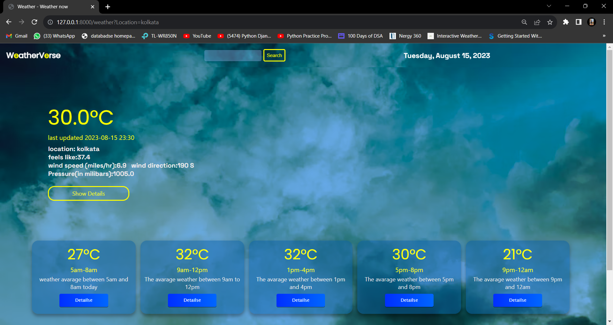

# <h1>WeatherVerse</h1>


Our weather app provides near-accurate weather reports 

## Features

- hourly weather report
- every detail
- 3 day report
- alearts

## Demo

link comes here
## Installation

To run this app locally, follow these steps:

1. Clone this repository:
   ```bash
   git clone https://github.com/Ar12agnik/weather-app
   cd /weather_app_django
   ```

2. Install the dependencies:
   ```bash
   pip install django
   ```

3. Start the development server:
   ```bash
   Python manage.py runserver
   ```

## Technologies Used

- Django(a python framework)
- HTML, CSS, JS

## API Usage

To use the weather API in this app, you'll need to obtain an API key:

1. Go to [WEATHERAPI](https://www.weatherapi.com/) and sign up for an account.
2. Once registered, select a plan, and then you'll receive an API key.
3. Copy the API key and replace `YOUR_API_KEY` in `main.py` with your actual API key.

## Screenshots




## Contributing

Contributions are welcome! If you find any issues or want to add new features, please open an issue or submit a pull request.
special thanks to [Ayanabha Chatterjee](https://github.com/aYgCOO) for doing the entire front end part

## License

This project is licensed under the [MIT License](./LICENSE).
